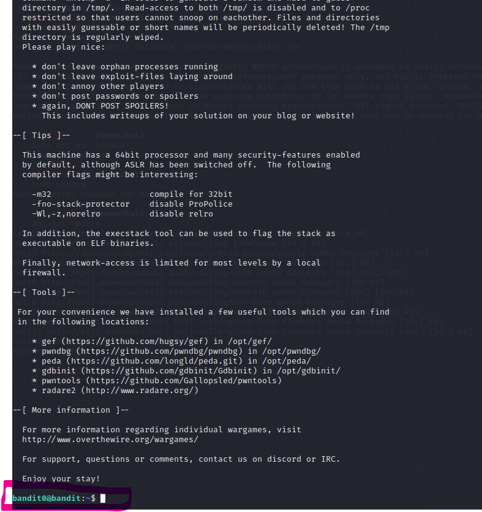
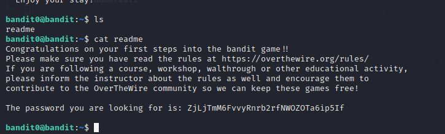
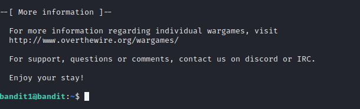
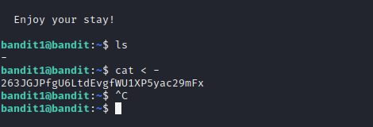
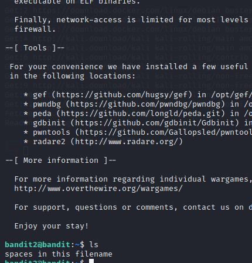
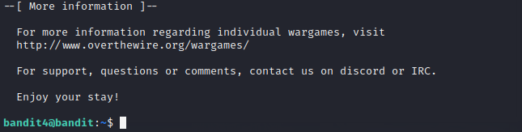
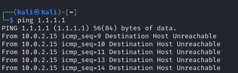

# Hack to learn hacking
### ayush ghimire
## DLL (Dynamic Link Library) Sideloading 
### by Anne Hautakangas
- Hackers use DLL files to bypass antivirus and EDR systems.
- DLL files are found inside the program files of applications.
- DLLs perform calculations and various functions for software.
- The way in which Windows searches for and loads DLLs can be exploited by threat actors.
- Adversaries exploit manifest files by replacing the DLL file with the same name as a legitimate DLL in a location where an application will load it before the legitimate DLL.
- Attackers can use Sliver to create a malicious DLL file and use a beacon so that whenever a victim runs the .exe file with the malicious DLL, the beacon will send the response.

---

## Command Line Basics

- `pwd`: Prints the working directory.
- `ls`: Lists the files in the working directory.
- `cd`: Change directory.
- `cd ..`: Move up one directory.

### File Manipulation

- `nano`: Text editor.
- `mkdir`: Create a new directory.
- `mv`: Move or rename a file.
- `cp`: Copy a file.
- `rmdir`: Remove an empty directory.
- `rm`: Remove a file.
- `rm -r`: Remove a folder and its contents.

### SSH Remote Control

- `ssh`: `ssh [username]@[host_ip_address] -p [port_number]` - Used to securely access the server or device.
- `scp`: `scp -r [file_name] [username]@[your_server]:/home/username/` - Securely copy a file to a folder in a remote machine.

### Help

- `man`: Show manual pages.
- `history`: Shows all the commands that have been used.

---

## Package Management

- `sudo apt-get update`: Update all available packages.
- `sudo apt-get -y install [application]`: Install a specific software.

## Solving the over the wire:the Bandits:
### Level 0 

### Level 1

### Level 2 

### Level 3

### Level 4

## PING

the "ping" is sending a ICMP request packets to the ip address 1.1.1.1, but it is receiving a response message of "destination host unreachable", this generally means that there is network problem between the host and the ip address "1.1.1.1". On analaysing the statistics report it shows that 47 packets were sent , out of 100% of the packets were lost.

