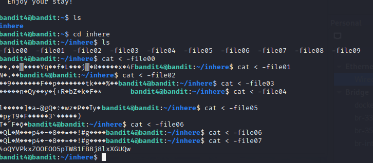
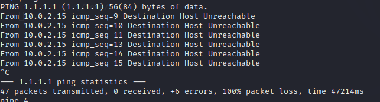
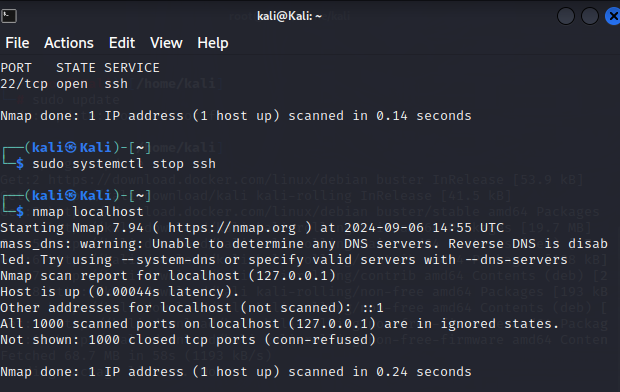
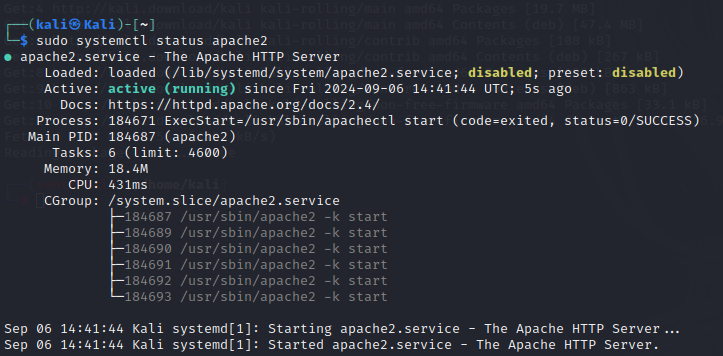

# Hack to learn hacking
### ayush ghimire
## DLL (Dynamic Link Library) Sideloading 
### by Anne Hautakangas
- Hackers use DLL files to bypass antivirus and EDR systems.
- DLL files are found inside the program files of applications.
- DLLs perform calculations and various functions for software.
- The way in which Windows searches for and loads DLLs can be exploited by threat actors.
- Adversaries exploit manifest files by replacing the DLL file with the same name as a legitimate DLL in a location where an application will load it before the legitimate DLL.
- Attackers can use Sliver to create a malicious DLL file and use a beacon so that whenever a victim runs the .exe file with the malicious DLL, the beacon will send the response.

---

## Command Line Basics

- `pwd`: Prints the working directory.
- `ls`: Lists the files in the working directory.
- `cd`: Change directory.
- `cd ..`: Move up one directory.

### File Manipulation

- `nano`: Text editor.
- `mkdir`: Create a new directory.
- `mv`: Move or rename a file.
- `cp`: Copy a file.
- `rmdir`: Remove an empty directory.
- `rm`: Remove a file.
- `rm -r`: Remove a folder and its contents.

### SSH Remote Control

- `ssh`: `ssh [username]@[host_ip_address] -p [port_number]` - Used to securely access the server or device.
- `scp`: `scp -r [file_name] [username]@[your_server]:/home/username/` - Securely copy a file to a folder in a remote machine.

### Help

- `man`: Show manual pages.
- `history`: Shows all the commands that have been used.

---

## Package Management

- `sudo apt-get update`: Update all available packages.
- `sudo apt-get -y install [application]`: Install a specific software.

## Solving the over the wire:the Bandits:
### Level 0 

### Level 1

### Level 2 

### Level 3

### Level 4

## PING

The "ping" is sending a ICMP request packets to the ip address 1.1.1.1, but it is receiving a response message of "destination host unreachable", this generally means that there is network problem between the host and the ip address "1.1.1.1". On analaysing the statistics report it shows that 47 packets were sent , out of 100% of the packets were lost.
There can be problem with the local network also such as misconfigured tables or fireballs to prevent entering the traffic from reaching the deatination 1.1.1.1.

In the above photo , icmp has succesfully reached ip address 1.1.1.1 , each response has returned within reasonable time range [ 27 ms to 163 ms], which also indicates that in the above mage , there was a netork issues. 

##Port Scanning 

 

-> This scan shows that all ports 1000 ports are closed , meaning the system is not actively running the services that listen on ports including SSH and apache server.
-> "Unable to determine any DNS servers": This means that nmap couldn't find any DNS servers to query for reverse DNS lookups.
"Reverse DNS is disabled": Reverse DNS is the process of converting an IP address back into a domain name. Since nmap couldn't find any DNS servers, it disabled this reverse DNS lookup process.

##Daemon
### intsalling the apache2

At first , i have use the command "sudo apt-get update" , after which it took 5 minutes to update all the avaiable packets in the systems. after that i have use the command "sudo apt-get install apache2" which took 1 minutes install. To start the apache server , command "sudo systemctl start apache2" which have started the service, and finally to check if the apache is running or not, i have used the command "sudo systemclt status apache2"

After again port scanning the local host address , i have found the following: - 
-> it shows that 998 ports are closed , whereas there were 2 ports opened as compared to last port scanning.
-> the port 22 which is used for the ssh is opened , after  i have used the command "sudo systemctl start ssh", 
-> the port 80 /tcp is also opened because of  the installation of apache2 server '
-> furthermore , it also shows that the device is using the linux, and and network distance .

 

