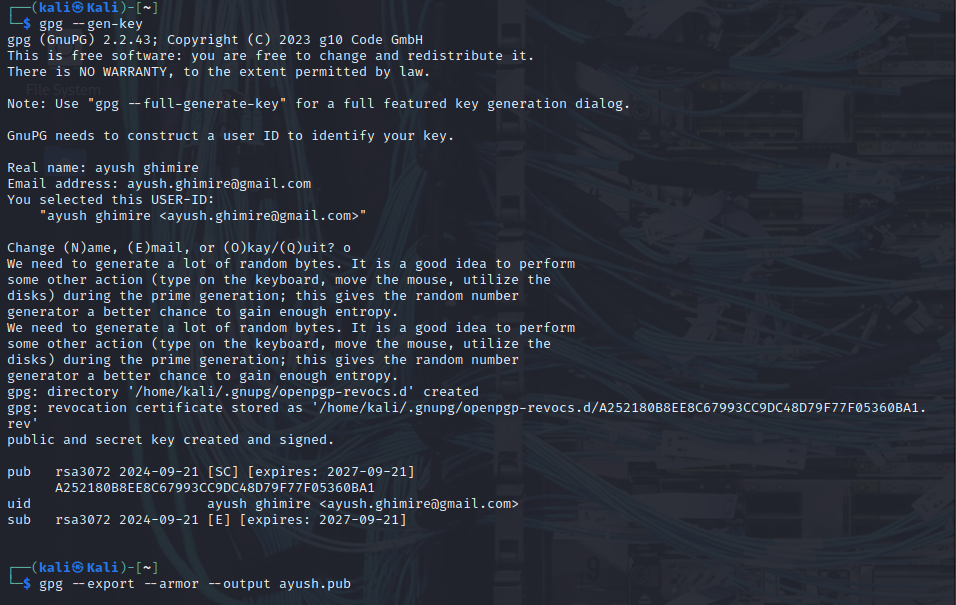
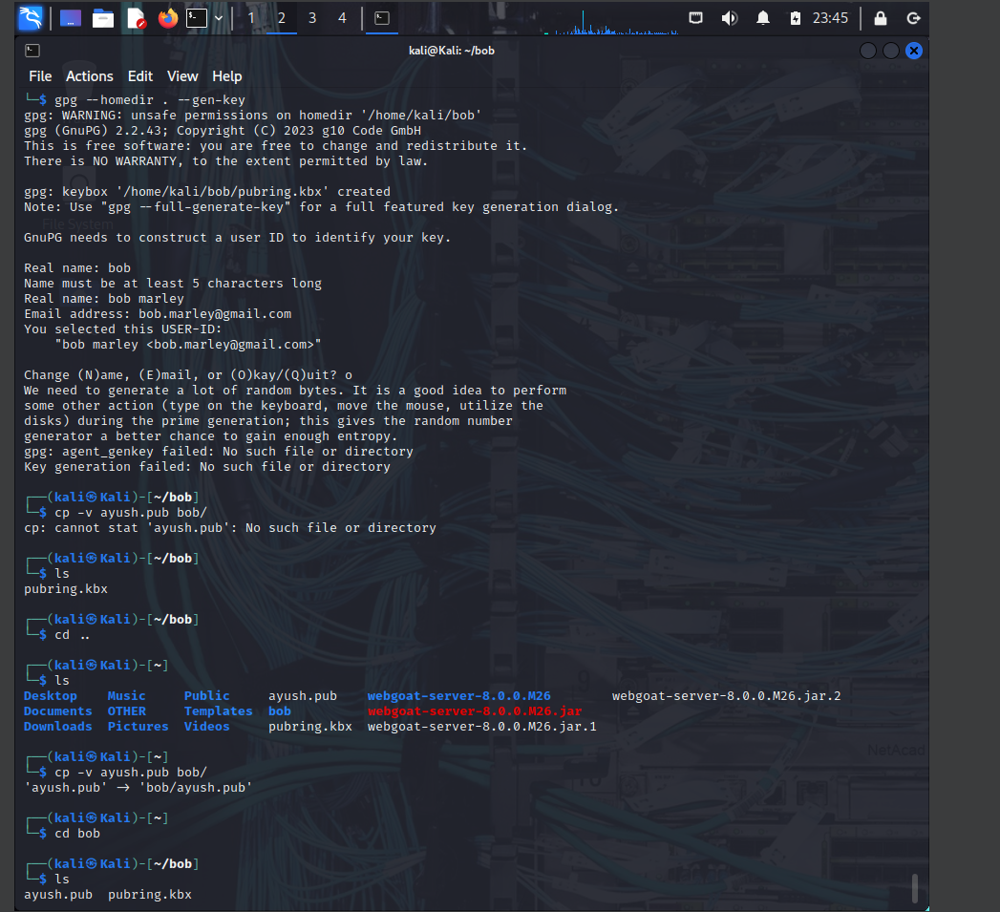
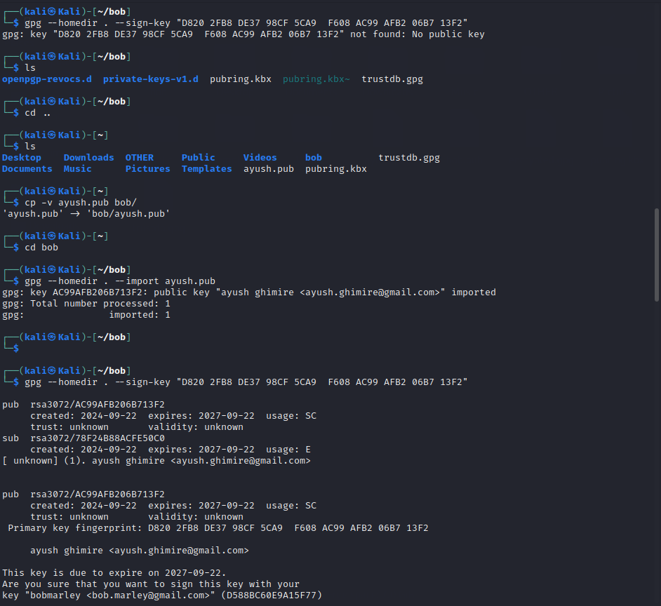
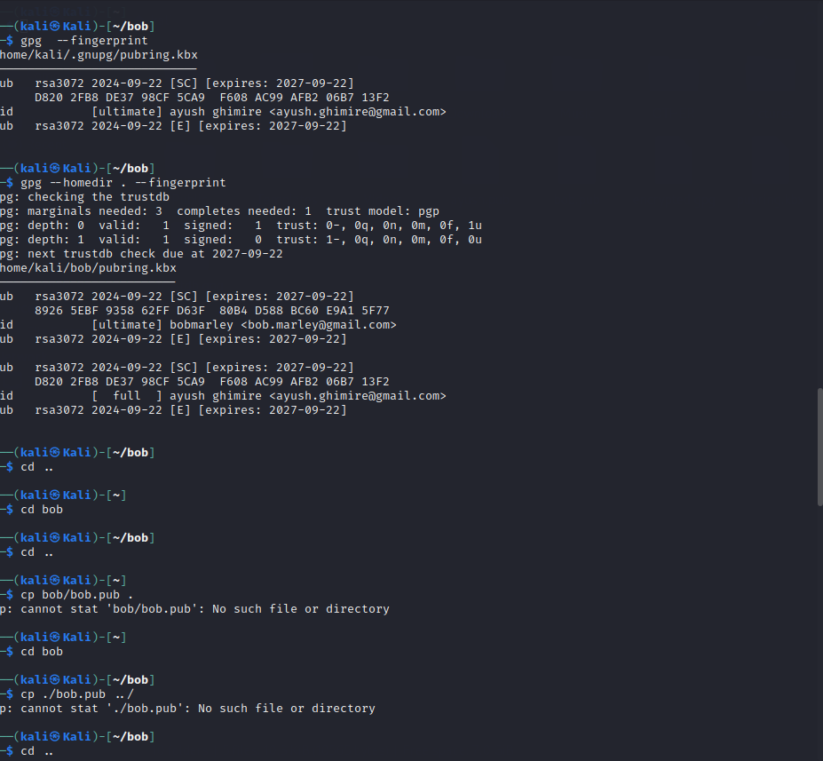
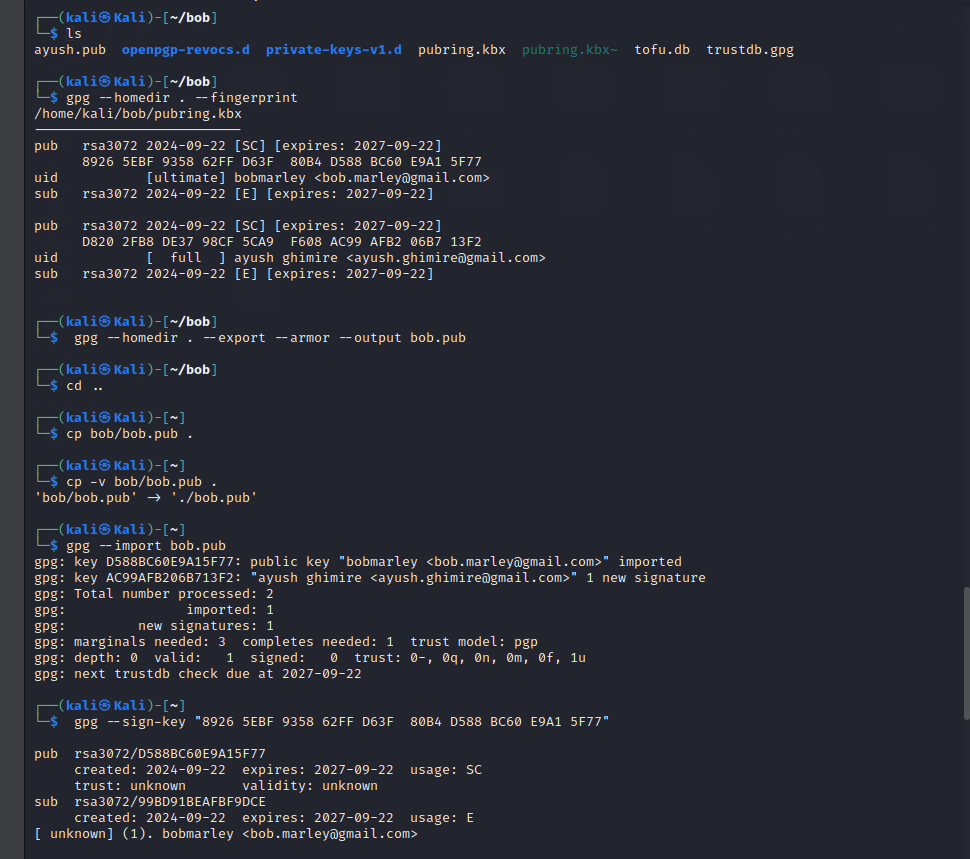
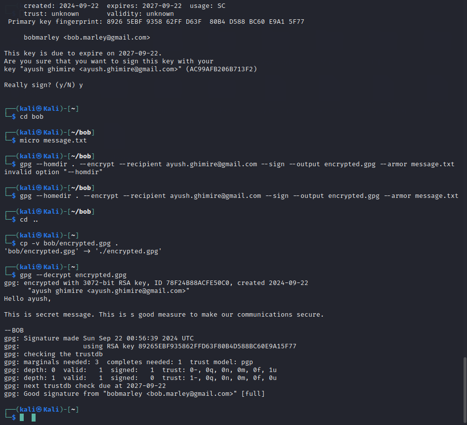
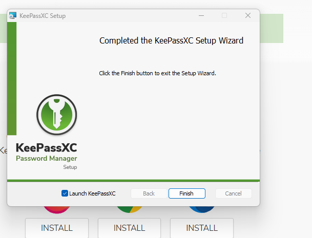

# H5 Uryyb, Greb!
### by ayush ghimire

## GPG 
GPG (GNU Privacy Guard) is an open-source encryption tool that allows you to encrypt and sign your data and communications. It's part of the OpenPGP standard, which defines encryption for securing emails, files, and other data, providing both confidentiality (through encryption) and authenticity (through digital signatures).

--> We need two users for communications 

First user -> ayush 
Second user -> Bob

#### Step 1 . 

$ sudo apt-get update
$ sudo apt-get install gpg micro psmisc

#### Step 2.  Creating a keypair

gpg --gen-key

tis will ask our email and name and then write "O"

#### Step 3. Now we need to check the keypair

gpg --fingerprint

This consists of fingerprint and secret key.

#### Step 4. Now , we need to export the key 

$ cd
$ gpg --export --armor --output ayush.pub
Parameters to export are

--export Export my public key
--armor Only use ASCII characters, so that the output can be viewed and copy -asted.
--output tero.pub Save the output into the file "ayush.pub"

## Step 5. Now we have to do the same thing for the Bob

gpg --homedir . --gen-key

## Step 6. Bob will verfies and sign the key 

gpg --homedir . --import ayush.pub
gpg --homedir . --sign-key "B624 CDED 2430 252D 298D  7EC4 A8D8 1658 00B3 84A3"

## Step 7. Ayush also needs to verfies and sign the key

$ gpg --import bob.pub
$ gpg --sign-key "B20F D80B 705C 791D C878  0030 7BAA 4F13 2645 134F"

Now the trust has been establised, we will use the micro to write a message then we will encrypt that message using gpg and send over the ayush , so that he can decrypt the message and see what inside the message.

Step 8. Encrpyt th message and sign the message 

gpg --homedir . --encrypt --recipient tero@example.com.invalid --sign --output encrypted.pgp --armor message.txt

cp -v bob/encrypted.pgp .

Step 9. Decrypt the message

gpg --decrypt encrypted.pgp 

## Foundations

-> A cryptographic algorithm (cipher) is a mathematical function used for encryption and decryption. Historically, restricted algorithms kept the method secret, but they are insecure and impractical today. Modern cryptography uses keys instead, where the algorithm can be publicly known but the security relies on the secrecy of the key. The encryption (E) and decryption (D) functions depend on the key, ensuring that without the correct key, an attacker cannot decipher the message, even if the algorithm is known. Some algorithms use different keys for encryption and decryption.

-> Symmetric Algorithms
  Symmetric (secret-key) algorithms: Use the same key for encryption and decryption.
  The encryption key can be derived from the decryption key.
  Both parties must share the key to communicate securely, and the key must remain secret.
  Symmetric ciphers are divided into:
  Stream ciphers: Encrypt data one bit/byte at a time.
  Block ciphers: Encrypt data in fixed-size blocks (e.g., 64-bit blocks).
  Public-Key Algorithms
  Public-key (asymmetric) algorithms: Use a pair of keys—one for encryption (public key) and a different one for decryption (private key).
  The encryption key (public) can be shared, but the decryption key (private) is kept secret.
  Used for digital signatures and secure communication.
  
->Cryptanalysis
  Cryptanalysis: The study of breaking cryptographic systems without access to the key.
  Assumes full knowledge of the cryptographic algorithm.
  Types of attacks:
  Ciphertext-only: Only ciphertext is available.
  Known-plaintext: Both plaintext and ciphertext are available.
  Chosen-plaintext: The attacker can choose the plaintext to be encrypted.
  Chosen-ciphertext: The attacker chooses ciphertext and sees the corresponding plaintext.
  Adaptive chosen-plaintext: The attacker modifies future plaintext choices based on results.

-> Security of Algorithms
  Security is based on how difficult it is to break an algorithm using available resources (computational power, time, data, etc.).
  Brute-force attack: Trying all possible keys until the correct one is found.
  Computationally secure: An algorithm that cannot be broken with current or foreseeable resources.
  Complexity of Cryptanalysis
  Data complexity: Amount of data needed for an attack.
  Processing complexity: Time required to break the encryption.
  Storage requirements: Memory needed for the attack.

##  Pretty Good indeed

## Password Manager

 1: Installing the password manager

2: Why do we need password manager

1. Weak Passwords
  Threat: Many users resort to weak or easily guessable passwords, making it easier for attackers to gain unauthorized access.
  Protection: Password managers generate strong, complex passwords that are difficult to crack, reducing the risk of brute-force attacks.
2. Password Reuse
  Threat: Users often reuse passwords across multiple accounts. If one account is compromised, attackers can access others.
  Protection: Password managers allow users to create unique passwords for each account, ensuring that a breach in one account does not lead to breaches in others.
3. Phishing Attacks
  Threat: Phishing attacks trick users into entering credentials on fraudulent sites.
  Protection: Many password managers have built-in features that detect and warn users of phishing sites, helping to prevent credential theft.
4. Credential Stuffing
  Threat: Attackers use lists of leaked usernames and passwords to gain access to multiple accounts.
  Protection: Unique passwords for each account minimize the effectiveness of credential stuffing attacks.
5. Secure Storage
  Threat: Storing passwords in plaintext (e.g., in a document or spreadsheet) makes them vulnerable to theft.
  Protection: Password managers encrypt stored passwords, making them accessible only with the master password, protecting them from unauthorized access.
6. Convenience
  Threat: Users may struggle to remember numerous complex passwords, leading to insecure practices (like writing them down).
  Protection: Password managers store all credentials securely and autofill them, encouraging better password hygiene.
7. Two-Factor Authentication (2FA) Integration
  Threat: Relying solely on passwords can be insufficient security.
  Protection: Many password managers support 2FA, enhancing security by requiring an additional verification step.

### 3. How to use 
1. create a database on the PC.
2. Click on "+" to add a particular username , password, url and the title for the credentials.(p.s i was going to take some screenshots and put it there , but when i tried to do it , the password manager is minimized or it has the feature that nobody can take a screeshot.)

